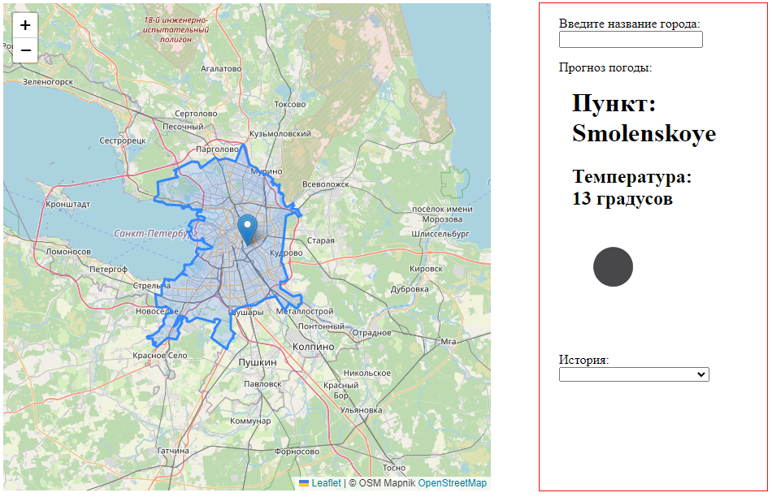
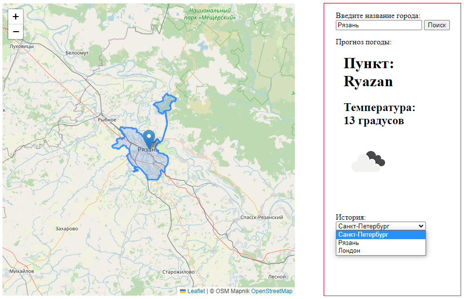

# weather-forecast

# Домашнее задание "Прогноз погоды

Ссылка на github pages https://maxter1971.github.io/weather-forecast/

## Описание

### Назначение проекта

Приложение отображает прогноз погоды в указанном пользователем населённом пункте.
При запуске приложения карта позиционируется на локации пользователя и отображается
прогноз погоды.

При вводе населённого пункта и нажатии кнопки "Поиск" указанный пункт отображается на карте,
и отображается прогноз погоды. В выпадающем списке "История" отображается
последние 10 населённых пунктов, которые искал пользователь. При клике на запись в списке
истории на карте отображается указанный населённый пункт, а также отображается текущая погода.
В истории отображается только уникальные записи.

### Структура проекта

В каталоге ./src расположены:
index.js
checker.js
checker.test.js
history.js
history.test.js
loader.js
map.js
updateApp.js
weather.js
weather.test.js

В каталоге ./css
style.css

**index.js** импортирует checker.js,history.js,updateApp,loader.js, style.css,
обработчик нажатия кнопки "Поиск" _buttonClick_ и обработчик выбора населённого пункта в списке "История"
_selectorClick_. Запускает cтартовую инициализацию карты _initializeMap_, получает локацию пользователя функцией _getStartLocation_
и обновляет приложение функцией _updateAppByCity_.

**checker.js** Реализует проверку наличия текста в поле для ввода населённого пункта

**history.js** Реализует функции получения истории _getHistory_ и обновления истории _setHistory_

**loader.js** Реализует асинхронные функции получения локации пользователя функцией _getStartLocation_, получения координат по имени населённого пункта _getCityCoords_,
получения данных погоды по координатам _getWeatherData_

**map.js** Реализует функцию инициализации карты _initializeMap_ и функцию обновления карты _updateMap_

**updateApp.js** Реализует функцию обновления приложения _updateAppByCity_ в виде цепочки промисов получения координат населённого пункта, обновления карты и погоды

**weather.js** Реализует функцию обновления отображения погоды _setWeather_

**style.css** содержит стили
